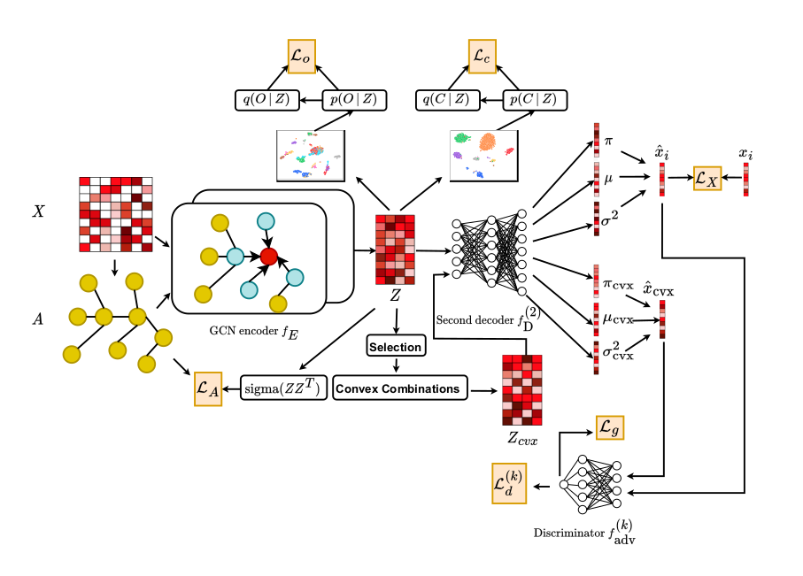

# Toward Convex Manifolds: A Geometric Perspective for Deep Graph Clustering of Single-cell RNA-seq Data

The deep clustering paradigm has shown great potential for 
discovering complex patterns that can reveal cell heterogeneity 
in single-cell RNA sequencing data. This paradigm involves two 
training phases: pretraining based on a pretext task and 
fine-tuning using pseudo-labels. Although current models yield
promising results, they overlook the geometric distortions that 
regularly occur during the training process. More precisely, the 
transition between the two phases results in a coarse flattening
of the latent structures, which can deteriorate the clustering 
performance. In this context, existing methods perform 
euclidean-based embedding clustering without ensuring the
*flatness* and *convexity* of the latent manifolds.
To address this problem, we incorporate two mechanisms. 
First, we introduce an overclustering loss to flatten the local 
curves. Second, we propose an adversarial mechanism to adjust
the global geometric configuration. More precisely, the second 
mechanism gradually transforms the latent structures into convex
ones. Empirical results on a variety of gene expression datasets 
show that our model outperforms state-of-the-art methods.

# Architecture
The neural network architecture of our approach as defined in scTCM.py


# Requirements
Installing the requirements using pip
```
$ pip install -r requirements.txt
```
# Usage 
To evaluate our approach on all datasets, run the Python scripts main_$dataset_name$.py.

```
$ python main_Young.py  
```

# Arguments
The values of three hyperparameters depend on the dataset: 
* threshold_2: The clustering threshold &beta;<sub>c</sub>      
* threshold_3: The overclustering threshold &beta;<sub>o</sub>
* overclustering: The number of overclusters n<sub>o</sub>


